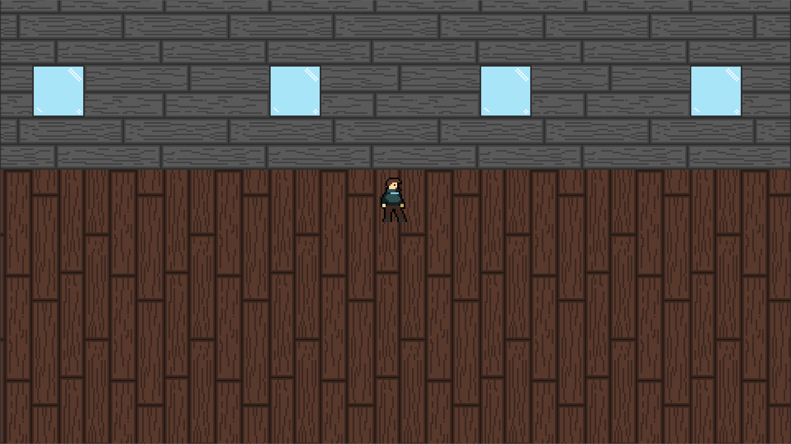

# IT Repair Shop Tycoon

## Popis hry

IT Repair Shop Tycoon je simulace a tycoon hra zaměřená na správu IT opravny. Hráč se stává majitelem opravny, kde spravuje zákazníky, opravuje zařízení a rozvíjí svůj podnik. Cílem hry je budovat reputaci, zvyšovat efektivitu oprav a získávat nové dovednosti.

## Hlavní vlastnosti

- **Správa zákazníků:** Přijímání zakázek, komunikace se zákazníky a organizace oprav.
- **Různé druhy zařízení:** Telefony a další elektronika s různými typy poruch.
- **Rozšiřování opravny:** Vylepšování vybavení, rozšiřování kapacity a zlepšování služeb.
- **Pixel art styl:** Atraktivní retro grafika vytvořená v nástroji Pixelorama.
- **Realistické zvukové efekty:** Zvuky nástrojů a interakcí vytvořené v Audacity.
- **8-bitová hudba:** Půjčená z internetu pro autentickou retro atmosféru.

## Použité technologie

- **Herní engine:** Godot
- **Grafika:** Pixelorama
- **Audio:** Audacity, 8-bitová hudba

## Ukázka vzhledu
Na tomto obrázku není všechen vzhled, jen základní jako je character, floor, wall a window. Ostatní jako je např. grafika telefonu je zde (https://github.com/MasterkoCZ/it-repair-shop/tree/main/Graphics)

## Autor

Josef Razák

## Licence

Tato hra je chráněna autorskými právy. Použití zdrojových kódů, grafiky nebo zvuku bez svolení autora není povoleno. Hudba je použitá pod licencí, která umožňuje její využití v nekomerčních projektech.
